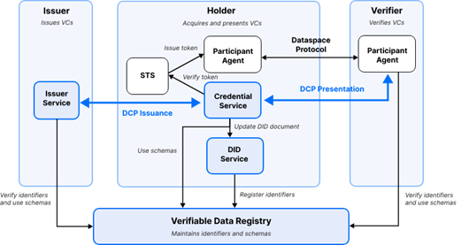
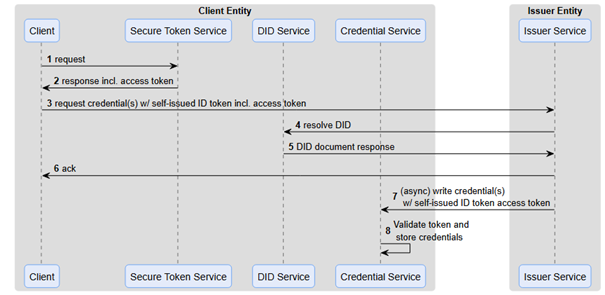
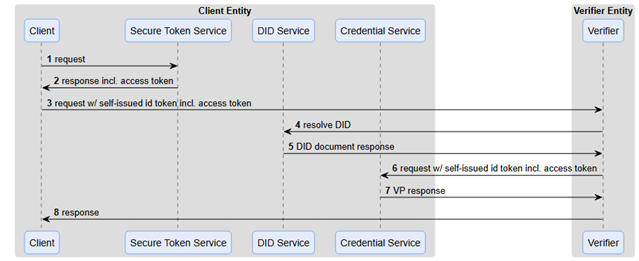
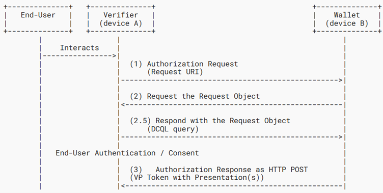

# Eclipse Decentralized Claims Protocol & OpenID4VC Protocol
_Areas of application, commonalities and differences, and application in Dataspaces._

## Executive Summary

This document delves into the comparative analysis of the [Eclipse Decentralized Claims Protocol (DCP)](https://projects.eclipse.org/projects/technology.dataspace-dcp)  and the [OpenID4VC Protocol (OID4VC)](https://openid.net/sg/openid4vc/). Both protocols serve essential roles in enabling secure, interoperable, and privacy-preserving data exchanges within digital ecosystems, yet their implementation diverges in meaningful ways. Understanding these contrasts is key to making informed decisions about which protocol to adopt for specific requirements within dataspaces.
In a dataspace, it'll be the responsability of the Dataspace Authority to decide which of the protocol suits better their interoperablity, policy and regulatory compliance requirements.

## Introduction
Trust in dataspaces is created through the reconciliation of policies, claims and evidence which support the required policies — a process that ensures all participating entities align with shared governance principles, operational standards and that access, contract and usage policies of data sharing contracts are met.

Policies, which define the rules and expectations within the dataspace, serve as the foundation for establishing trust. Claims, on the other hand, are assertions made by entities about their compliance with these policies or their possession of certain attributes.
At last, Evidences bring additional information to support one or more claims and facilitate the risk-assessment made by the participating entities.

Those policies, claims and evidences can be securely stored using Verifiable Credentials which ensure among other things, traceability and content-integrity.
There are different types of Verifiable Credentials (W3C VC v1/v2, IETF SD-JWT, ISO mdoc/mDL, AnonCreds, ...) and both DCP and OpenID4VC can be used to issue and present W3C Verifiable Credentials.

The reconciliation process begins with verifying claims and evidence against established policies. Leveraging credential exchange protocols such as DCP and OID4VC, facilitate the secure presentation of policies, claims and evidence for reconciliation. These protocols enable cryptographic assurances, ensuring that policies, claims and evidences are tamper-proof and verifiable without exposing sensitive underlying data. By validating these claims and evidence in compliance with the dataspace's overarching policies, participating entities can confirm their adherence to shared norms, fostering mutual trustworthiness.

Moreover, this iterative process of reconciliation is dynamic, allowing the dataspace to adapt as policies evolve or as new participants join and new data sharing contracts are being offered. It creates an environment where trust is not a static agreement but an ongoing commitment, harmonized through transparency, accountability, and technological safeguards.

## Use Case: Utilizing Decentralized Identities and Verifiable Credentials in Manufacturing-X for Digital Product Passports

### Introduction to Manufacturing-X
Manufacturing-X represents a transformative vision for industrial collaboration within Europe, aimed at establishing a secure and interoperable dataspace for manufacturers. As an initiative, it seeks to bridge organizational silos and promote data sharing across the manufacturing ecosystem, including supply chain partners, technology providers, and regulators. This digital infrastructure emphasizes trust, transparency, and adherence to governance policies.

### Understanding the Digital Product Passport (DPP) 
The Digital Product Passport (DPP)  is a digital record that contains essential information about a product’s lifecycle, including its materials, production processes, environmental impact, and compliance certifications. The DPP serves as a cornerstone of the European Union's push toward sustainability and circular economy practices.

The European Commission has mandated DPPs under the framework of the Ecodesign for Sustainable Products Regulation (ESPR). This regulation, adopted as part of the European Green Deal, aims to ensure products are designed with sustainability in mind and include data that supports their reuse, recycling, and responsible disposal. The implementation of DPPs will become mandatory for certain product categories starting in 2027, with a phased rollout across industries.

## How Decentralized Identities and Verifiable Credentials enable the creation of trustworthiness in dataspaces

### Scenario
Two parties, a component manufacturer (Company A) and a systems integrator (Company B), are collaborating within Manufacturing-X to share data regarding a digital product passport for a machine component. The DPP must include detailed information about the component’s materials, environmental impact, and compliance with safety standards.

### Step 1: Establishing Decentralized Identities
Decentralized identities form the backbone of trust in this ecosystem. Company A and Company B, each possess their own decentralized identifiers (DIDs), which are unique representations of their identities within the dataspace. These DIDs are coupled with verifiable credentials issued by trusted entities, such as regulatory authorities or certification bodies.

For example, Company A might possess credentials verifying its compliance with ISO 14001 environmental management standards, while Company B holds credentials confirming its adherence to industry specific safety protocols.

### Step 2: Exchanging Verifiable Credentials
To share data related to the DPP, the two companies exchange claims supported by their verifiable credentials. Using a protocol such as the Eclipse DCP, Company A can present claims that demonstrate the environmental sustainability of its production processes without exposing sensitive proprietary data. Similarly, Company B can substantiate its claims regarding safety compliance in a secure, cryptographic manner.

### Step 3: Verifying Claims Against Policies
Upon receiving the claims, each company verifies them against the established policies within their dataspace and/or data sharing contract respectively. These policies ensure participants meet the shared governance standards of the dataspace. For instance, the claims regarding the environmental impact of the component are checked against ESPR requirements, while industrial safety claims are validated against industry regulations.

### Step 4: Establishing Trust for Data Sharing
With claims successfully validated, mutual trust is established. Company A agrees to share the detailed DPP data with Company B, knowing it will be used responsibly and in compliance with the dataspace’s policies and according to the policies in the data sharing contract. Company B, in turn, ensures it maintains the integrity and confidentiality of the data while integrating it into broader systems for traceability and lifecycle management, as mandated by the usage policies of the data sharing contract.

### Step 5: Dynamic Adaptation
As participants (e.g. through M&A activities) and policies evolve or new participants join the dataspace and additional data sharing contracts are being offered, the reconciliation of claims continues dynamically. This iterative approach ensures trust is maintained even as the dataspace grows or adopts new regulatory requirements.

### Use case conclusion
In the context of Manufacturing-X, decentralized identities and verifiable credentials empower organizations like Company A and Company B to exchange data securely and transparently. By leveraging protocols such as the Eclipse DCP, these entities not only adhere to the requirements of the Digital Product Passport but also foster a collaborative environment rooted in trust and compliance. As Europe moves toward the mandatory implementation of DPPs under the ESPR, such technologies will play a crucial role in realizing the vision of Manufacturing-X.

## Introduction to Decentralized Claims in Dataspaces
The issuance, presentation and verification of decentralized claims requires a protocol for securely sharing decentralized identities and credentials. It helps ensure that data access is secure by verifying identities and credentials without relying on a central authority.

### Key Concepts and Terms
- __Dataspace:__ A governance framework and supporting services to build trustworthiness and enable data sharing through an agreed set of policies and procedures.
- __Participant:__ An organization, which is a member of the dataspace, i.e. obliged to comply to the common governance framework.
- __Credential Issuer:__ An entity that provides verifiable credentials to participants.
- __Verifier:__ An entity that checks the validity of the credentials presented by participants.
- __Self-Issued ID Tokens:__ Tokens created and signed by participants themselves to prove their identity.
- __Wallet:__ a store for Verifiable Credentials

### Fundamentals
1.	Issuing Credentials: A Credential Issuer provides verifiable credentials to an organization. These credentials can be used to prove the organization's identity and access rights.
2.	Presenting Credentials: The organization presents these credentials to a Verifier when providing claims to another party. The Verifier checks the credentials' validity using a decentralized registry.

*Figure 1 Issuer-Holder-Verifier Model*

### Consent and Trust
- __Consent:__ Organizations must approve the release of their credentials. This is managed through predefined policies.
- __Trust Relationships:__ Trust is established through secure lists of trusted issuers and participating organizations (participants), maintained by the Dataspace Governance Authority (DSGA).
### Decentralization
- Each participant manages their own identity tokens and credentials.
- Multiple trust anchors (Credential Issuers) can exist within a dataspace, providing flexibility and resilience.
### Base Protocols
- __Verifiable Presentation Protocol:__ Defines how credentials are stored and presented.
- __Credential Issuance Protocol:__ Defines how credentials are requested and issued.
### Security Measures
- All participants must communicate securely via HTTPS.
- Credentials and presentations must be tamper-proof and support revocation.
### Profiles
- Different profiles define specific ways to handle credentials, revocation, and proof mechanisms to ensure interoperability.

## Eclipse Decentralized Claims Protocol (DCP)
In the DCP specification the generic Issuer-Holder-Verifier Model is extended and mapped to the needs of dataspaces and the organizations participating.

*Figure 2 DCP Information Flow Architecture*

Within the context of a dataspace, two organizations (participants) need to exchange their identity and claims information to enable the interactions defined in the [Dataspace Protocol (DSP)](https://eclipse-dataspace-protocol-base.github.io/DataspaceProtocol/). DSP enables the negotiation of data sharing contracts, which contain the policies for which a participant needs to present claims. This is being done through Verifiable Credentials which the holder must present to a verifier.

The Issuer Service issues credentials to a holder’s credential service. As part of this process the Issuer Service will verify the holder’s decentralized identity (DID) using the Verifiable Data Registry, which is used to resolve the holder’s DID document and cryptographic material.

Every participant in the dataspace needs to run three logical services to be able to act as a holder of verifiable credentials: a Participant Agent, which will include a self-issued ID Token. This token will be obtained from a Secure Token Service (STS) controlled by the holder. The token contains an Access Token, which is bound to the Verifier and will be used to request a Verifiable Presentation. The holder’s Credential Service will verify this token with the STS.

The verifier also operates a Participant Agent that engages with the holder agent. When it receives a request, it will resolve the holder’s DID document from the Verifiable Data Registry and through this resolve the endpoint for the holder’s Credential Service. It will then send a request for a Verifiable Presentation to the Credential Service, which includes the access token received from the holder’s agent. The participant agent will then match the credentials returned in the Verifiable Presentation against the policy constraints associated the original dataspace request.

This enables the establishment of consent for the release and access to a protected resource. Since the Dataspace Protocol is built on machine-to-machine message exchange patterns for Software Agents (Dataspace Connectors), end-user consent is not applicable.

The first step in the interaction is for an issuer to issue a verifiable credential for a claim to an organization, which in this case is the client asking for the issuance from the issuer entity:

 

*Figure 3 Issuance Flow*

This process enables the issuer entity to write a verifiable credential to the credential store of the organization.

During the negotiation of a data sharing contract the participant offering the contract will ask the organization which requests the data sharing contract to provide verifiable credentials that contain proof that the policy is being met. Those claims need to be verified with a verifier to know whether they are to be trusted.

An organization asking for the verification of a claim can use the following flow to verify a claim:

*Figure 4 Presentation flow*

Now that the claim was verified, the participant offering the data sharing contract can evaluate the policy and check whether the provided claim sufficiently covers the requirements of the policy to be accepted as proof of conformance.

## OpenID for Verifiable Credentials (OID4VC)
Founded in 2007, the OpenID Foundation (OIDF) is a global open standards body committed to helping __people__ assert their identity wherever they choose.

The OpenID for Verifiable Credentials (OID4VC) protocol specifically focuses on enabling the issuance, presentation, and verification of verifiable credentials as digital proofs of claims. It consists of multiple specifications :
- OpenID for Verifiable Credential Issuance (OID4VCI)
- OpenID for Verifiable Presentations (OID4VP)
- OpenID4VC High Assurance Interoperability Profile (HAIP)
- Self-Issued OpenID Provider v2 (SIOPv2)
- OpenID for Verifiable Presentations over BLE
- OpenID Connect UserInfo Verifiable Credentials

The [OID4VC Issuance specification](https://openid.github.io/OpenID4VCI/openid-4-verifiable-credential-issuance-wg-draft.html) defines an OAuth-protected API for the issuance of Verifiable Credentials. It allows a Credential Issuer to assert End-User claims. Verifiable Credentials can be securely presented for the End-User to the Resource Provider, without involvement of the credential issuer.

It requires an End-User Wallet as the store in which the holder can request, receive, store, present and manage Verifiable Credentials and cryptographic key material.

The [OID4VP specification](https://openid.net/specs/openid-4-verifiable-presentations-1_0.html) defines a mechanism on top of OAuth 2.0 to request and present Verifiable Credentials as Verifiable Presentations. It introduces the VP Token as a container to enable End-Users to present Verifiable Presentations to Verifiers using a Wallet. The specification is an extension of OpenID Connect to allow presentation of claims in the form of W3C Verifiable Credentials  as part of the protocol flow.

The basic flow of the presentation of a credential to a verifier is best illustrated with a diagram from the specification:

*Figure 5 OID4VP flow*

## Dataspaces as communities of organizations
Before delving into the details of the comparison of OpenID Specs and the Eclipse DCP it is important to understand that dataspaces are communities of organizations, not of human actors.

While it’s true that many times it will be human end-users requesting to share data, this type of authorization flow happens outside of the dataspace and is part of the application layer of each organization. From there to the actual data sharing contract of a dataspace many different software stacks and processes can interact before it becomes necessary to negotiate a data sharing contract between organizations.

Dataspaces are designed to enable software agents representing organizations to negotiate data sharing contracts and to execute on those. A data sharing contract might represent a one-time data transfer, a continuous stream of data, or a regularly recurring event (e.g. regulatory data sharing obligations). Many of these activities will need to be automated to a degree where thousands of those negotiations and/or contract validations can happen in seconds. Take for example the use case of Manufacturing-X mentioned above. If every single part of a car, plane, train, ship or sufficiently complex industrial goods needs to be accompanied by a Digital Product Passport, which needs to be shared throughout the supply chain it will be prohibitively expensive and slow to have each and every sharing contract agreed upon and approved by humans. Especially as the legal entities participating are companies and the human end user requesting the setup of a data sharing contract is at best metadata information to tie the contract negotiation to a legal representative of the organization. However, even in those cases the human end-user doesn’t need to be represented in the data sharing contract as a credentialed identity, as it’s always the organization that is the entity which needs identification and credentials.

__Once you add AI scenarios and automated AI agents negotiating data sharing contracts the situation becomes utterly hopeless for any protocol which requires human authorization.__

### Issues this creates for OID4VC
The use of decentralized identities and verifiable credentials in highly automated, software agent-based systems like dataspaces raises a couple of questions and issues for the use of OID4VC at this layer of a data ecosystem architecture:
- How is the automatic discovery of a DID going to happen? OpenID does not have a process for this that would not require a user to share this information actively. Any process devised to enable automatic discovery on top of OpenID could potentially lead to either DDOS attacks against the identity store or the leak of existence of data sharing contract offers that the other party isn’t authorized to know.
- There is no mechanism in OID4VC or OID4VP that would allow for the correlation of contract offers and agreements to determine policies.
- The Authorization Request Reference with Consent Object would need to be forwarded from the Dataspace Connector to the Wallet, which adds a potential attack vector. This process would need to be standardized so different wallet implementations can be interoperable.
- Custom Wallet extensions are needed for the comparison of the consent object to the presentation definition.
- The Authentication Token needs to be bound to specific credentials and Proof of Possession is required, how is the end-user transferring this to the organization on which behalf the contract negotiation is being conducted?
- How can the connector use the Demonstration of Proof of Possession for the authentication token without the private key of the wallet?
- The token needs to be correlated with the DSP offer messages to guard against clients using a token to obtain different datasets.
- How does the connector evaluate policies at this point because it needs the original credentials? E.g.: a policy constraint may require a value in the credential subject. Or a credential claim is required to fetch data.

## DCP to the rescue
As you can see, there are many unresolved issues in the use of OpenID specifications for dataspaces. Since OpenID never intended their specifications to be used in machine-to-machine scenarios its user centric design isn’t well suited for the control plane of a dataspace. Many customizations would be required that will diverge the dataspaces implementations from the OpenID specifications. Should those specifications evolve in the future this will pose a massive challenge as it might not be possible to reconcile existing customizations with future versions of the OpenID specifications.

So why take the risk and heavily customize a protocol for a novel use if there is the possibility to create a new protocol? One specifically designed to solve the issues faced by organizations in dataspaces and which is being developed under control of the dataspace community in the Eclipse Dataspace Working Group!

DCP is designed to enable machine-to-machine scenarios without human intervention, to enable an ecosystem of highly interoperable dataspaces.

It is built to enable massive scale, support the interaction of automated software agents and to represent the organization and its claims. Should a specific regulation or process require the presence of end user credentials it is always possible to express those as a claim and have DCP provide this claim to the other party. I.e.: the user information could be encoded as it’s own claim, even containing a signature from the user, which provides certainty about that user account having been involved in the creation of this claim.

## Additional considerations about using OpenID
However, despite the challenges shown above OpenID might still be a valuable addition to dataspaces. Potential enabling services, like validation services for specific Trust Frameworks, or other value add services (Marketplaces, Observers…) might require the authentication of specific human end-users to their service and thus rely on OID4VC and OID4VP to integrate end user credentials in the inherently decentralized architecture of dataspaces.

## Conclusion
The Eclipse Decentralized Claims Protocol is best suited for the use of claims issuance, management, presentation and verification at the architectural layer of the dataspace control plane. It has been designed to enable software agents (dataspace connectors) to represent organizations in a decentralized dataspace.

It is the key difference between dataspaces and the use cases for which OID4VC has been designed. In dataspaces, policies vary by data asset and data sharing contract and may evolve over time. OpenID use cases are generally static and typically require one known credential type. Dataspaces provide a mechanism to express what policies are required for a specific data sharing context and for associating those policies with required credentials. Which may change on every data request. OpenID does not address this context.
